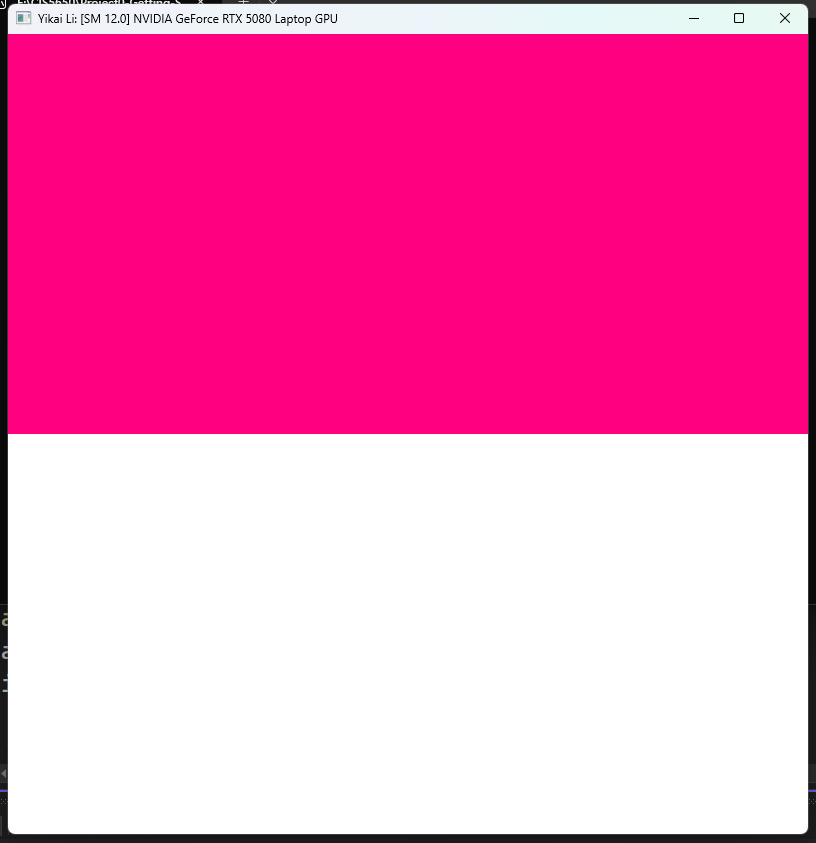
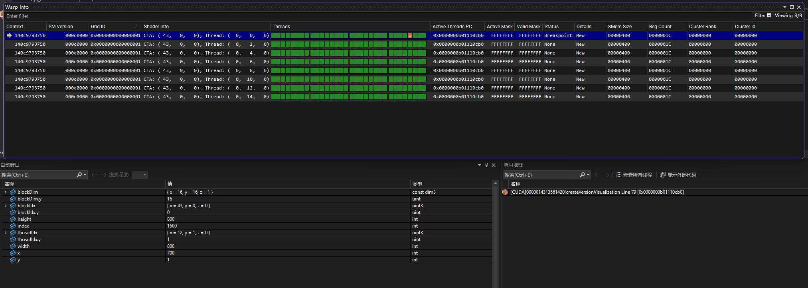
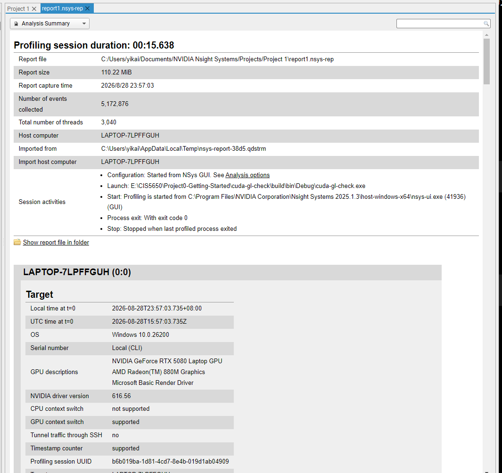
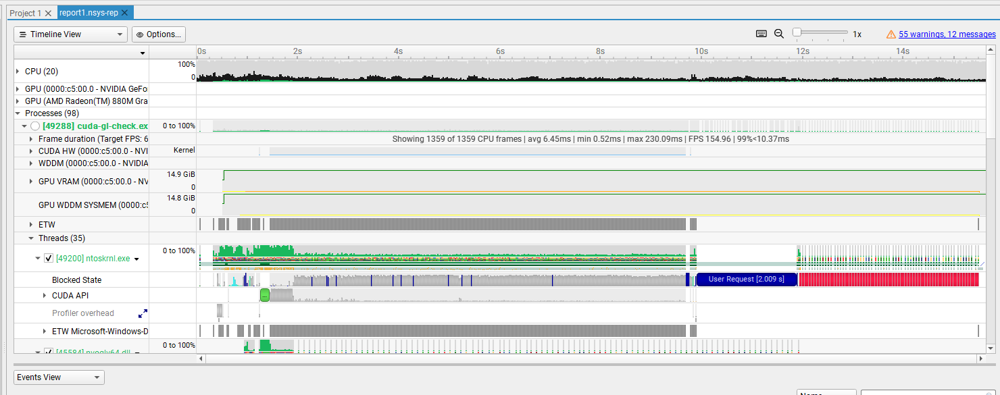
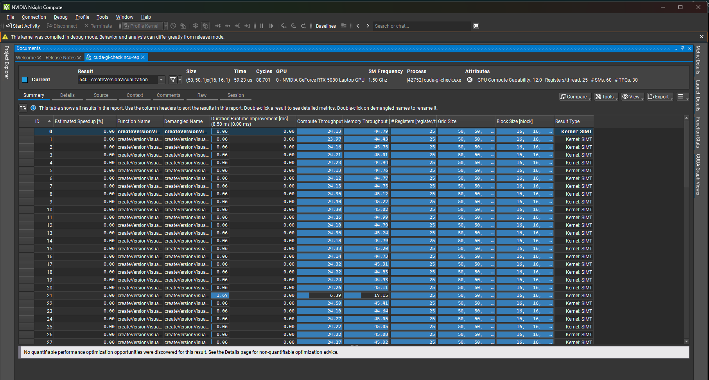
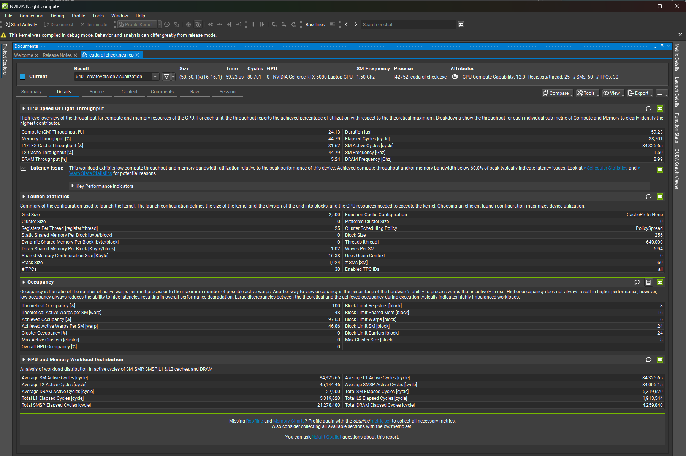
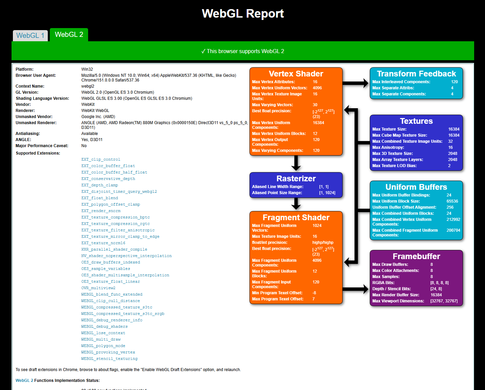
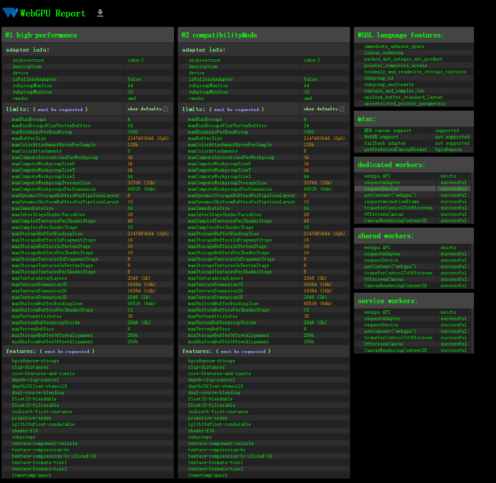

Project 0 Getting Started
====================

**University of Pennsylvania, CIS 5650: GPU Programming and Architecture, Project 0**

* Yikai Li
* Tested on: Razer Blade 16 (RZ09-0528), Windows 11 Home 25H2 64-bit, AMD Ryzen AI 9 365 with Radeon 880M (10 cores), 32 GB LPDDR5-8000 RAM, NVIDIA GeForce RTX 5080 Laptop GPU 16 GB (Personal Computer)

## CUDA GL Check

The CUDA/OpenGL interoperability check compiled and ran successfully on my personal computer.

* GPU: NVIDIA GeForce RTX 5080 Laptop GPU
* CUDA Compute Capability: 12.0
* CUDA architecture: SM 12.0 (`sm_120`)
* The application successfully displayed two colors.

## Nsight CUDA Debugging

Nsight CUDA Debugging successfully stopped at the conditional breakpoint `index == 1500` in `kernel.cu`.

The selected CUDA thread had the following values:

* `blockIdx = (43, 0, 0)`
* `threadIdx = (12, 1, 0)`
* `index = 1500`
* `x = 700`
* `y = 1`

The selected thread was located in the first warp of CTA `(43, 0, 0)`.

## Nsight Systems

Nsight Systems successfully captured the execution of `cuda-gl-check.exe`. The report includes the application timeline, CPU activity, CUDA API activity, GPU activity, memory usage, and application threads.

### Analysis Summary

### Timeline

## Nsight Compute

Nsight Compute successfully profiled the `createVersionVisualization` CUDA kernel on the NVIDIA GeForce RTX 5080 Laptop GPU.

The kernel achieved high occupancy, but its compute and memory throughput remained below the peak capabilities of the GPU. The Nsight Compute report identifies the workload as latency-limited. This result is reasonable because CUDA GL Check is a small diagnostic application rather than a performance-intensive workload.

### Summary

### Details

## WebGL

Google Chrome successfully reported hardware-accelerated WebGL 2 support. The browser used the integrated AMD Radeon 880M Graphics adapter through ANGLE and Direct3D 11.

## WebGPU

Google Chrome successfully created a WebGPU adapter and device. The reported adapter uses the AMD RDNA 3 architecture and is not a fallback software adapter. The WebGPU API, adapter request, device request, and rendering contexts were all reported as successful.

## Build Configuration

No changes were made to either `CMakeLists.txt` file.

